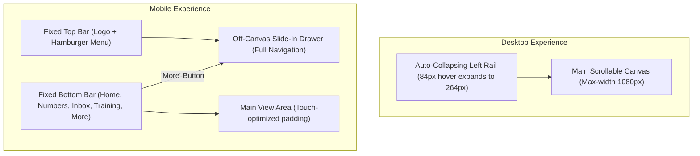

# Phase 1: Application Architecture & Frontend Design System

## 1. Next.js App Router Structure

The application follows the idiomatic Next.js App Router directory convention:

```
src/
├── app/
│   ├── (auth)/                                # Authentication route group
│   │   ├── login/page.tsx
│   │   ├── invite/page.tsx
│   │   ├── verify/page.tsx
│   │   └── layout.tsx
│   │
│   ├── (admin)/                               # Internal Admin portal
│   │   ├── admin/
│   │   │   ├── page.tsx                       # Admin Executive Dashboard
│   │   │   ├── clients/page.tsx               # Client Roster & Provisioning
│   │   │   ├── templates/page.tsx             # Master Portal Template Manager
│   │   │   ├── users/page.tsx                 # Team & CSM Management
│   │   │   ├── security/page.tsx              # Security Audit Logs
│   │   │   └── layout.tsx                     # Admin Shell & Navigation
│   │
│   ├── (csm)/                                 # Internal CSM workspace
│   │   ├── csm/
│   │   │   ├── page.tsx                       # Assigned Clients Overview
│   │   │   ├── onboarding/page.tsx            # Cross-client Onboarding Board
│   │   │   └── layout.tsx                     # CSM Shell & Navigation
│   │
│   ├── (portal)/                              # Client-facing portal instance
│   │   ├── portal/[tenantId]/
│   │   │   ├── page.tsx                       # Overview & Snapshot
│   │   │   ├── onboarding/page.tsx            # Checklist & Phase Progression
│   │   │   ├── performance/page.tsx           # Leads, Pipeline & SMS Composer
│   │   │   ├── inbox/page.tsx                 # In-portal Business Email
│   │   │   ├── measure/page.tsx               # Roof Measurement Satellite Canvas
│   │   │   ├── business/page.tsx              # Profile, Identity, LLC & Whop
│   │   │   ├── resources/page.tsx             # Marketing & Support Hub
│   │   │   ├── training/page.tsx              # Applicator Course & Quiz
│   │   │   ├── coach/page.tsx                 # Sales Coach (AI Text/Audio)
│   │   │   ├── practice/page.tsx              # Call Practice (Voice Homeowner)
│   │   │   ├── brand/page.tsx                 # Canvas Brand Studio & AI Photo
│   │   │   └── layout.tsx                     # Responsive Sidebar/Drawer Shell
│   │
│   ├── api/                                   # REST endpoints & Webhooks
│   │   ├── client-view/route.ts               # Tenant Data Aggregator
│   │   ├── client-step/route.ts               # Step Status Mutations
│   │   ├── actions/route.ts                   # AI CRM Action Executor
│   │   ├── coach/route.ts                     # Sales Coach Handler
│   │   ├── coach-call/route.ts                # Realtime Audio Session Issuer
│   │   ├── webhooks/
│   │   │   ├── ghl/route.ts                   # GoHighLevel Inbound Webhook
│   │   │   └── whop/route.ts                  # Payment KYC Status Webhook
│   │   └── push/route.ts                      # Web Push Subscription Manager
│   │
│   ├── layout.tsx                             # Global Root HTML & Theme
│   ├── robots.ts                              # Enforces strict noindex/disallow
│   └── manifest.webmanifest/route.ts          # Dynamic PWA Manifest per tenant
│
├── components/                                # Reusable UI Components
│   ├── ui/                                    # Buttons, Cards, Modals, Inputs
│   ├── shell/                                 # Sidebar, Mobile Topbar, Bottom Rail
│   ├── onboarding/                            # Phase Cards, Status Pills, Trackers
│   ├── measure/                               # Canvas Tile Renderer & Polygon Tools
│   └── ai/                                    # Chat Bubble, Voice Visualizer, Audio
│
├── lib/                                       # Core Utilities & Services
│   ├── db/                                    # Supabase Client & RLS helpers
│   ├── ghl/                                   # GoHighLevel API Client
│   ├── sheets/                                # Google Sheets Service
│   ├── ai/                                    # LLM Wrappers & Prompts
│   └── security/                              # Token validation, rate limiting
│
└── styles/
    ├── tokens.css                             # CSS Variables (Colors, Spacing, Fonts)
    └── globals.css                            # Global Resets & Base Typography
```

---

## 2. Layout & Responsive Navigation Architecture

The client portal implements a **dual-mode responsive shell**:



---

## 3. Modern Minimalist Design System

To fulfill the mandate for **modern, minimalist, state-of-the-art aesthetics**, the interface strictly avoids generic web styling in favor of an engineered design token system:

### 3.1. Color Palette (Dark Theme Core)
- **Background Primary**: `#0B1015` (Deep space slate)
- **Background Secondary / Panels**: `#111822` (Elevated slate)
- **Card Fill**: `linear-gradient(180deg, rgba(93, 183, 216, 0.05), transparent 45%), #111822`
- **Primary Accent / Cyan**: `#34A5CB` (Vibrant cyan)
- **Cyan Light**: `#5DB7D8` (Interactive hover & text accents)
- **Success / Done**: `#3FB97C` (Forest emerald)
- **Warning / Attention**: `#E0A63A` (Warm amber)
- **Blocked / Destructive**: `#E5484D` (Crimson rose)
- **Borders & Dividers**: `1px solid rgba(255, 255, 255, 0.08)`

### 3.2. Typography Pairing
- **Headings & Key Metrics**: `Archivo` (Weights: 700, 800) — Bold, industrial, geometric authority.
- **Body & Controls**: `Montserrat` / `Inter` (Weights: 400, 500, 600) — Clean, legible, humanistic.
- **Identifiers, Code & Numbers**: `IBM Plex Mono` (Weights: 500, 600) — Monospace precision for EIN, tracking numbers, and percentages.
