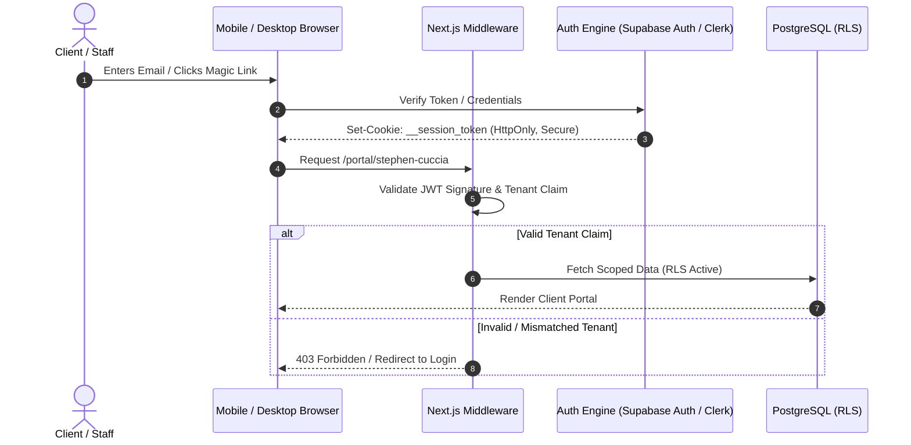

# Phase 1: Authentication Architecture

Authentication establishes verifiable identity across internal staff and external client organizations, resolving the prototype's reliance on permanent URL query tokens.

---

## 1. Authentication Strategy & Session Topology

The system implements **Stateless JWTs backed by Secure HttpOnly Cookies**:
- Eliminates permanent URL access keys (`?id=...&k=...`).
- Session cookies are flagged with `HttpOnly; Secure; SameSite=Lax`.
- Refresh token rotation provides persistent mobile PWA access without compromising security.

---

## 2. Magic Link & Invitation Architecture

For external clients and team members, friction-free login is paramount:
1. **Admin / CSM Provisions Portal**: Generates a secure, cryptographically random invitation token.
2. **Delivery**: The client receives a personalized invitation link via email or SMS:
   `https://motionz.ai/auth/verify?token=7f9d8a3...`
3. **Consumption & Expiration**:
   - Invitation links are valid for **72 hours** and expire immediately upon single use.
   - Upon consumption, the user confirms their profile, establishes optional credentials (password or WebAuthn / Passkey), and receives an authenticated session cookie.
4. **Subsequent Logins**:
   - Clients request an instant **Login Magic Link** valid for **15 minutes**.
   - Clicking the link logs them into their assigned portal immediately.

---

## 3. Multi-Factor Authentication (2FA / MFA)

- **Admin & CSM Roles**: Mandatory Time-Based One-Time Password (TOTP) 2FA (e.g. Google Authenticator, 1Password) or WebAuthn hardware security keys.
- **Client & Team Roles**: Optional 2FA, configurable by the Client Owner in their profile settings.

---

## 4. Addressing Requirement Conflict: Domain Policy Resolution

As documented in [open-questions.md](../00-project-definition/open-questions.md), the system proposes a **Domain-Segmented Routing Architecture**:

| Access Tier | Permitted Email Domains | Authentication Method |
| :--- | :--- | :--- |
| **Admin Portal (`/admin`)** | Strictly `@motionz.ai` | Google Workspace SSO / OIDC + Mandatory TOTP 2FA |
| **CSM Workspace (`/csm`)** | Strictly `@motionz.ai` | Google Workspace SSO / OIDC + Mandatory TOTP 2FA |
| **Client Portal (`/portal/*`)** | Any verified business or personal domain (`@apexroofing.com`, `@gmail.com`) | Magic Link / Email OTP / Passwordless Passkey |
