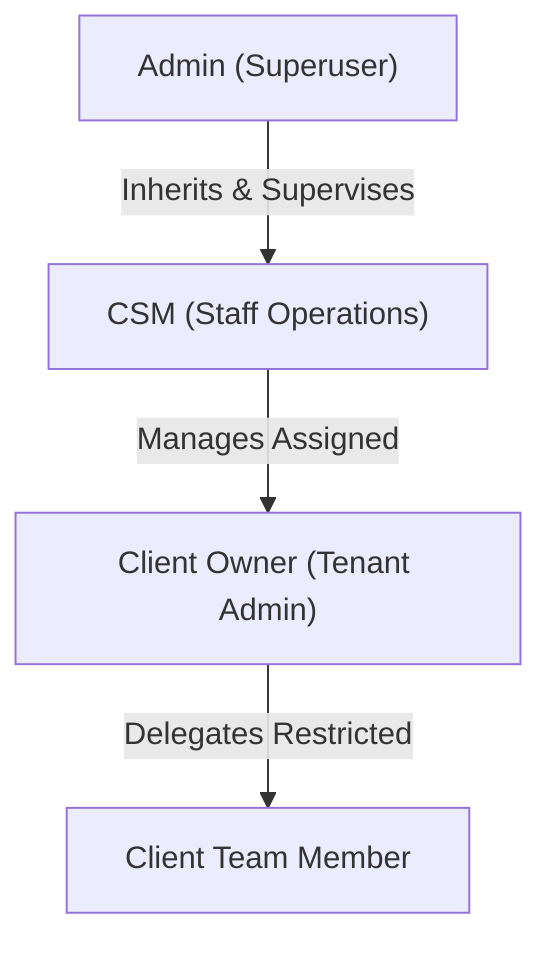
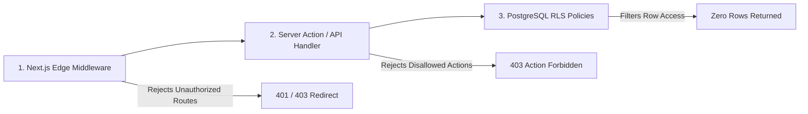

# Phase 1: Authorization & RBAC Architecture

Authorization governs what authenticated actors are permitted to see, execute, and mutate across the platform.

---

## 1. Role Hierarchy & Scope



- **Global Scope**: Only `Admin` and `CSM` operate at the multi-tenant supervisory level.
- **Tenant Scope**: `Client` and `Client Team Member` are strictly scoped to `tenant_id = user.tenant_id`.

---

## 2. Guard Enforcement Layers

Authorization is enforced at three sequential code boundaries:



### 2.1. Middleware Enforcement (`middleware.ts`)
Inspects route prefix against the verified session role:
```typescript
export function middleware(req: NextRequest) {
  const session = getSession(req);
  const path = req.nextUrl.pathname;

  if (path.startsWith('/admin') && session.role !== 'admin') {
    return NextResponse.redirect(new URL('/login?err=unauthorized', req.url));
  }

  if (path.startsWith('/csm') && !['admin', 'csm'].includes(session.role)) {
    return NextResponse.redirect(new URL('/login?err=unauthorized', req.url));
  }

  if (path.startsWith('/portal/')) {
    const routeTenantSlug = path.split('/')[2];
    if (session.role === 'client' || session.role === 'client_member') {
      if (session.tenantSlug !== routeTenantSlug) {
        return new NextResponse('Forbidden: Cross-tenant access denied', { status: 403 });
      }
    }
  }
}
```

### 2.2. Server Action Capability Guard
Before mutating data, Server Actions invoke a typed capability guard:
```typescript
export async function updateOnboardingStep(stepId: string, status: StepStatus) {
  const session = await requireAuth();
  
  // Verify actor has permission to override step status
  if (!hasPermission(session.role, 'onboarding:update_status')) {
    throw new AuthorizationError('Insufficient permissions to update onboarding step status');
  }

  // Execute database update with tenant isolation
  return db.step.update({
    where: { id: stepId, tenantId: session.tenantId },
    data: { status, updatedAt: new Date() }
  });
}
```

---

## 3. Granular Capability Permission Tokens

| Permission Token | Description | Admin | CSM | Client | Member |
| :--- | :--- | :---: | :---: | :---: | :---: |
| `platform:analytics` | View executive platform health & cross-client stats | ✅ | ❌ | ❌ | ❌ |
| `portal:provision` | Clone master template into new client portal | ✅ | ✅ | ❌ | ❌ |
| `portal:delete` | Permanently delete or archive a client portal | ✅ | ❌ | ❌ | ❌ |
| `portal:toggle_feature` | Enable/disable modules per client portal | ✅ | ❌ | ❌ | ❌ |
| `onboarding:edit_step` | Modify step copy, instructions, and unlock criteria | ✅ | ✅ | ❌ | ❌ |
| `onboarding:update_status` | Override milestone status (`Done`, `In Progress`) | ✅ | ✅ | ❌ | ❌ |
| `contract:view` | View and download executed agreements & LLC docs | ✅ | ✅ | ✅ | ⚠️ (Toggle) |
| `leads:view` | Inspect live GoHighLevel leads & pipeline metrics | ✅ | ✅ | ✅ | ✅ |
| `leads:send_sms` | Send outbound SMS messages via in-portal composer | ✅ | ✅ | ✅ | ✅ |
| `tools:measure_roof` | Use satellite roof measurement tool & export specs | ✅ | ✅ | ✅ | ✅ |
| `ai:assistant_execute` | [OUT OF SCOPE] Trigger CRM actions via AI assistant | ❌ | ❌ | ❌ | ❌ |
| `team:manage` | Invite and remove client organizational team members | ✅ | ✅ | ✅ | ❌ |
| `profile:edit` | Update company address, phone, and brand identity | ✅ | ✅ | ✅ | ❌ |
