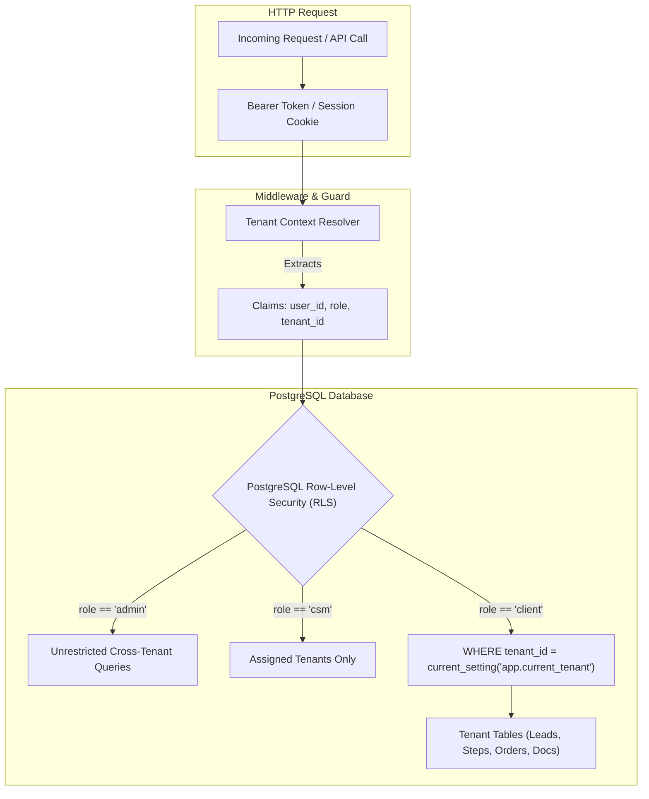

# Phase 1: Multi-Tenancy & Data Isolation Model

Multi-tenancy is the architectural cornerstone of the **Motionz Onboarding Portal**. Because clients are competing businesses (e.g. regional roofing contractors and dealerships), **strict cross-tenant data isolation** is mandatory.

---

## 1. Multi-Tenancy Architecture Pattern

The system adopts the **Shared Database, Shared Schema with Row-Level Isolation** pattern:
- All tenant data coexists within a single PostgreSQL database to ensure frictionless administrative reporting, portal duplication, and template management.
- Every tenant-scoped table contains a mandatory `tenant_id` (foreign key to `tenants.id`).
- PostgreSQL **Row-Level Security (RLS)** acts as the database-level firewall, ensuring no query can return or mutate records belonging to a different tenant.



---

## 2. Row-Level Security (RLS) Policy Design

### 2.1. Tenant Session Setting
In Supabase/PostgreSQL, every authenticated transaction sets the contextual session variable before query execution:
```sql
-- Executed per transaction/connection based on verified JWT
SET LOCAL app.current_tenant_id = 'c102a465-748f-4d92-9385-02f891b94d93';
SET LOCAL app.current_user_role = 'client';
```

### 2.2. Standard Table RLS Policy Template
Every tenant-scoped table (`onboarding_steps`, `client_leads`, `contracts`, `orders`, `dealer_assets`) implements the canonical isolation policy:
```sql
-- Enable RLS
ALTER TABLE client_leads ENABLE ROW LEVEL SECURITY;

-- 1. Client & Team Member Policy: Strict isolation to own tenant
CREATE POLICY client_tenant_isolation ON client_leads
FOR ALL
TO authenticated
USING (
  tenant_id = NULLIF(current_setting('app.current_tenant_id', true), '')::UUID
);

-- 2. Admin Superuser Bypass Policy: Full access across all tenants
CREATE POLICY admin_full_access ON client_leads
FOR ALL
TO authenticated
USING (
  current_setting('app.current_user_role', true) = 'admin'
);

-- 3. CSM Access Policy: Access to assigned client tenants
CREATE POLICY csm_assigned_access ON client_leads
FOR ALL
TO authenticated
USING (
  current_setting('app.current_user_role', true) = 'csm'
  AND tenant_id IN (
    SELECT tenant_id FROM csm_assignments 
    WHERE user_id = auth.uid()
  )
);
```

---

## 3. Defense-in-Depth Leak Prevention

Isolation is enforced at three distinct layers:

1. **Routing & URL Layer**: Middleware validates that the requested route parameter `[tenantId]` matches the `tenant_id` claim encoded in the user's session JWT. Mismatched requests immediately terminate with `403 Forbidden`.
2. **Server Action & API Layer**: All data fetchers and mutators explicitly include `WHERE tenant_id = :sessionTenantId` in their application logic.
3. **Database RLS Layer**: Even if application code contains a bug or omits a `WHERE` clause, PostgreSQL automatically filters out rows belonging to other tenants.
