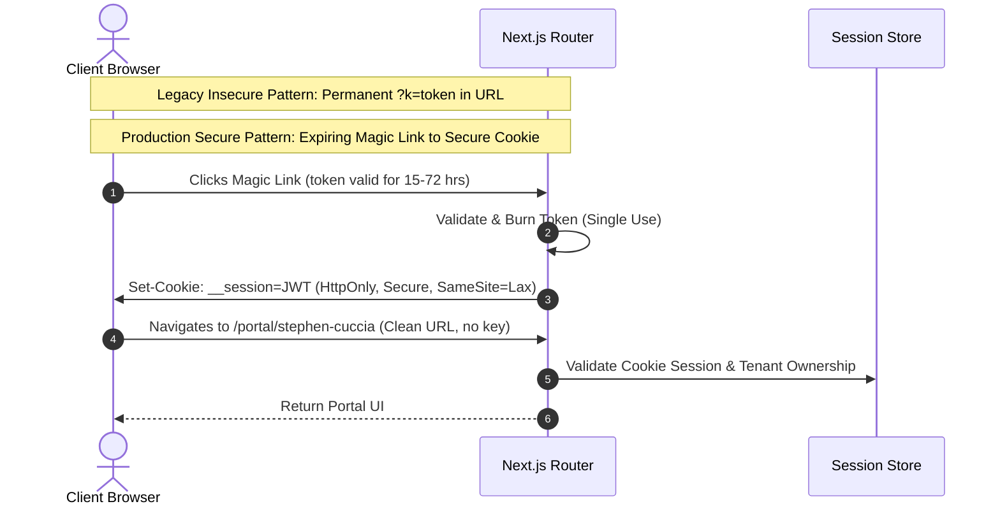

# Phase 1: Security Architecture & Threat Modeling

Security is a foundational non-functional requirement for the **Motionz Onboarding Portal**. The system operates on a **Zero-Trust Multi-Tenant Architecture** ensuring complete operational quarantine between client portals.

---

## 1. Threat Model & Mitigations (STRIDE Matrix)

| Threat Category | Potential Risk Vector | Architectural Mitigation |
| :--- | :--- | :--- |
| **Spoofing** | Attacker impersonates another client or CSM | Strong session validation via HttpOnly secure JWTs; token expiration; mandatory 2FA for Admin/CSM accounts. |
| **Tampering** | User alters request payload to modify another tenant's onboarding step | Next.js Server Actions validate `tenant_id` context against verified session claims; PostgreSQL Row-Level Security rejects cross-tenant SQL writes. |
| **Repudiation** | Actor denies requesting LLC filing, sending an SMS, or altering a step | Centralized, immutable `audit_logs` table records actor ID, tenant ID, timestamp, IP address, user agent, and payload diff. |
| **Information Disclosure** | Search engines index private portals; Client A views Client B's leads | Global `X-Robots-Tag: noindex, nofollow` headers; strict `robots.txt`; parameterized RLS queries eliminating IDOR vulnerabilities. |
| **Denial of Service** | Bot floods AI assistant or geocoding APIs | Upstash Redis rate limiting on all API routes and AI endpoints (e.g. max 20 requests/minute per client). |
| **Elevation of Privilege** | Client user attempts to access `/admin` or `/csm` endpoints | Multi-tier middleware rejects route access before component execution; RBAC capability token checks at server action boundaries. |

---

## 2. Prohibition of Permanent URL Access Keys

In accordance with security requirements, the prototype's permanent query key pattern (`?id=...&k=...`) is deprecated in favor of a **Secure Session Handshake**:



---

## 3. Search Engine Indexing Protection

To prevent search engines from discovering or caching private client business information:
1. **HTTP Headers**: Middleware injects security headers into every response:
   ```http
   X-Robots-Tag: noindex, nofollow, noarchive, nosnippet
   X-Frame-Options: SAMEORIGIN
   X-Content-Type-Options: nosniff
   Referrer-Policy: strict-origin-when-cross-origin
   Content-Security-Policy: default-src 'self'; script-src 'self' 'unsafe-inline' https://server.arcgisonline.com;
   ```
2. **`robots.txt`**: Served at `/robots.txt`:
   ```txt
   User-agent: *
   Disallow: /
   ```

---

## 4. Secrets & Encryption Key Management

- **Environment Secrets**: All master API keys (Supabase Service Role, OpenAI API Key, Slack Webhook URLs, Ayrshare Key) are stored exclusively in Vercel Environment Variables.
- **Tenant Credential Encryption**: Client-specific credentials (such as individual GoHighLevel Location API keys) are stored encrypted at rest in PostgreSQL using **AES-256-GCM** via an application master encryption key (`TENANT_ENCRYPTION_KEY`).
- **SSN & Financial Data Masking**: Social Security Numbers submitted via onboarding forms are encrypted at rest; the API layer only ever returns the last 4 digits (`***-**-1234`) to the frontend canvas.
