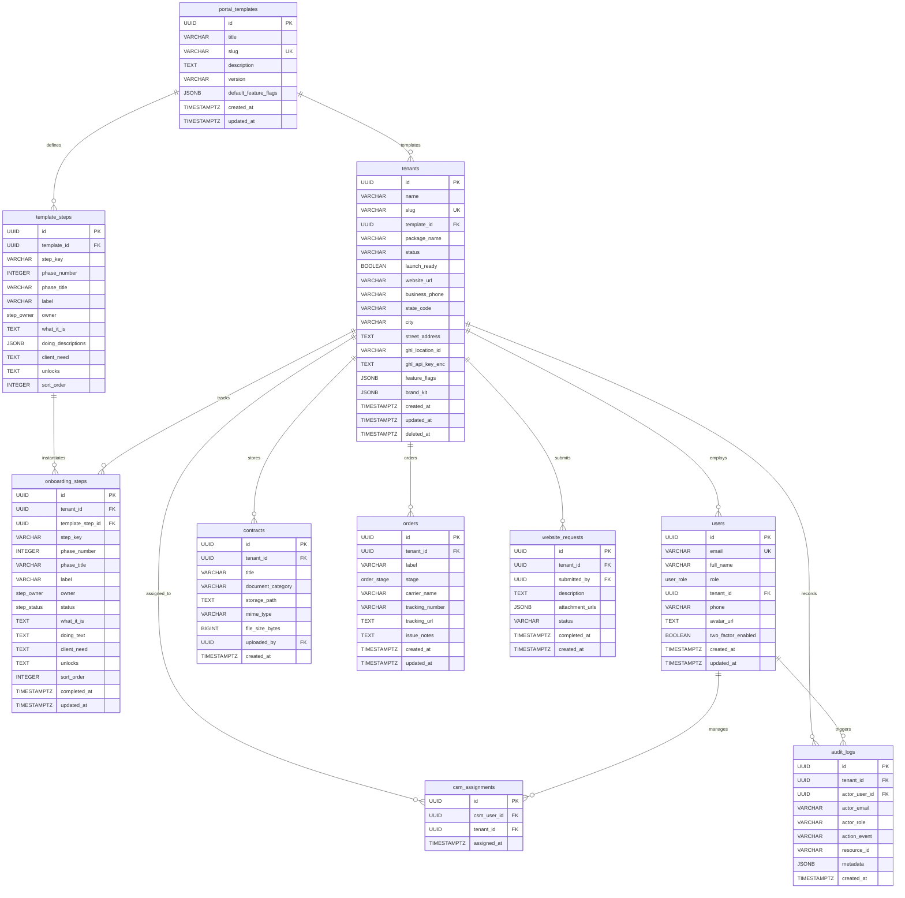

# Phase 2: Entity Relationship Diagram (ERD)

This document visually models the relational schema for the **Motionz Onboarding Portal** using Mermaid ER syntax.

---

## 1. Complete Relational ERD

