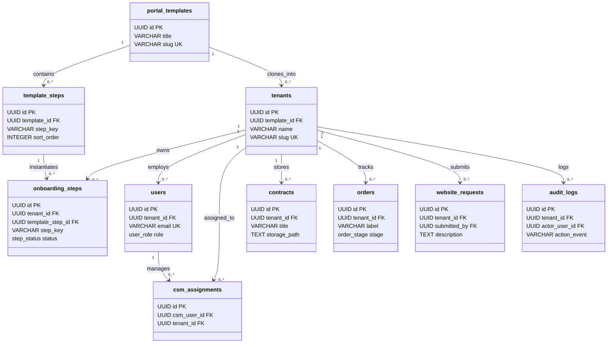

# Phase 2: Entity Relationships & Cardinality

This document defines the relational integrity, foreign key cascading rules, and relational constraints between system entities.

---

## 1. Cardinality & Relationship Matrix

---

## 2. Foreign Key & Deletion Cascade Policies

| Parent Table | Child Table | Foreign Key Column | Cascade Policy | Architectural Justification |
| :--- | :--- | :--- | :--- | :--- |
| `portal_templates` | `template_steps` | `template_id` | `ON DELETE CASCADE` | Deleting a template removes its baseline steps. |
| `portal_templates` | `tenants` | `template_id` | `ON DELETE SET NULL` | Deleting a template does not delete active client portals; portals retain their cloned data. |
| `tenants` | `onboarding_steps`| `tenant_id` | `ON DELETE CASCADE` | Permanently deleting a tenant purges its specific onboarding milestones. |
| `tenants` | `users` | `tenant_id` | `ON DELETE CASCADE` | Deleting a client tenant removes associated client-tier logins. |
| `tenants` | `csm_assignments` | `tenant_id` | `ON DELETE CASCADE` | Removing a tenant dissolves active CSM assignments. |
| `tenants` | `contracts` | `tenant_id` | `ON DELETE CASCADE` | Deleting a tenant purges document metadata (storage objects cleaned via lifecycle hooks). |
| `tenants` | `orders` | `tenant_id` | `ON DELETE CASCADE` | Deleting a tenant cleanses shipping records. |
| `tenants` | `website_requests`| `tenant_id` | `ON DELETE CASCADE` | Deleting a tenant cleanses support tickets. |
| `users` | `audit_logs` | `actor_user_id` | `ON DELETE SET NULL` | Audit logs are immutable; deleting a user preserves historical audit records with user ID set to null. |
