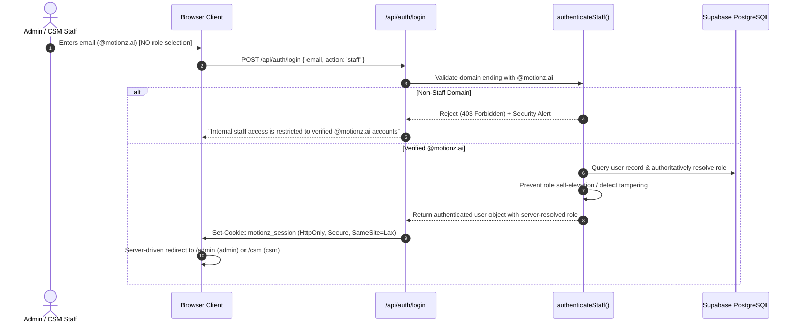
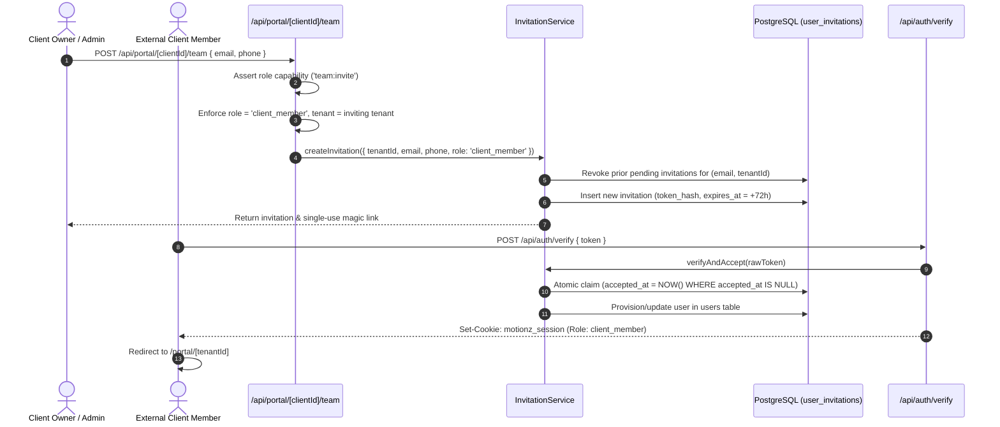

# Phase 02: Authentication & Access Implementation

This document details the production authentication lifecycles, token issuance mechanisms, and credential verification procedures for the **Motionz Onboarding Portal**.

---

## 1. Authentication Lifecycles

### 1.1. Internal Staff (Admin & CSM) Login Lifecycle



### 1.2. External Client & Team Member Invitation Lifecycle



---

## 2. Magic Link Security Specifications

- **Token Cryptography**: 256-bit cryptographically secure random bytes generated via `crypto.randomBytes(32).toString('hex')`.
- **Database Storage**: The raw token is hashed using SHA-256 before insertion into `public.user_invitations.token_hash`. The plain token is never stored or logged.
- **Expiration Threshold**: Exactly 72 Hours (3 days) from creation timestamp.
- **Single-Use Invalidation**: Upon receipt, the token is claimed atomically (`accepted_at = NOW()`). Subsequent attempts trigger an immediate `410 INVITATION_ALREADY_ACCEPTED` error.
- **Revocability**: Administrators can revoke active invitations at any time via `revokeInvitation()`.
- **Resend Safety**: Creating a new invitation automatically revokes any dangling pending invitations for the same `(email, tenant_id)`.

---

## 3. Session Cookie Configuration

Session tokens are generated via HMAC SHA-256 and stored in secure cookies:

```typescript
export const SESSION_COOKIE_NAME = 'motionz_session';

response.cookies.set(SESSION_COOKIE_NAME, sessionToken, {
  httpOnly: true,
  secure: process.env.NODE_ENV === 'production',
  sameSite: 'lax',
  path: '/',
  maxAge: 7 * 24 * 60 * 60, // 7 days persistent session
});
```

---

## 4. Session Revocation & Logout

- **Logout Endpoint**: `POST /api/auth/logout`
  - Validates active session and records `auth.logout` audit log entry and `auth_logout` security event.
  - Clears `motionz_session` cookie (`maxAge: 0`, `expires: new Date(0)`).
  - Returns `{ success: true, redirectTo: '/auth/login' }`.

---

## 5. Decision Log

| Decision Item | Status | Notes |
| :--- | :---: | :--- |
| Magic-Link Validity (72h) | **CONFIRMED** | Expiring single-use access link. |
| Client Member Mandatory Fields | **CONFIRMED** | Email + Phone Number only. |
| Domain Policy `@motionz.ai` | **CONFIRMED** | Non-staff domains strictly rejected from staff login. |
| Open Redirect Sanitization | **CONFIRMED** | Centralized via `sanitizeRedirectUrl`. |
| Concurrency Control | **CONFIRMED** | Atomic conditional update on `accepted_at IS NULL`. |
