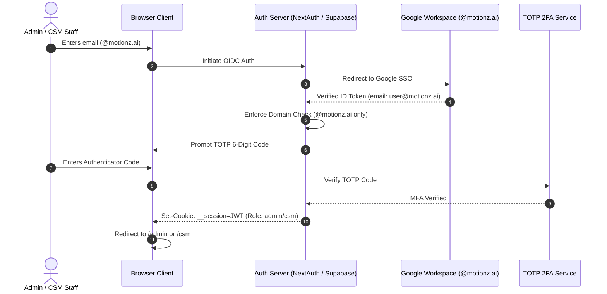
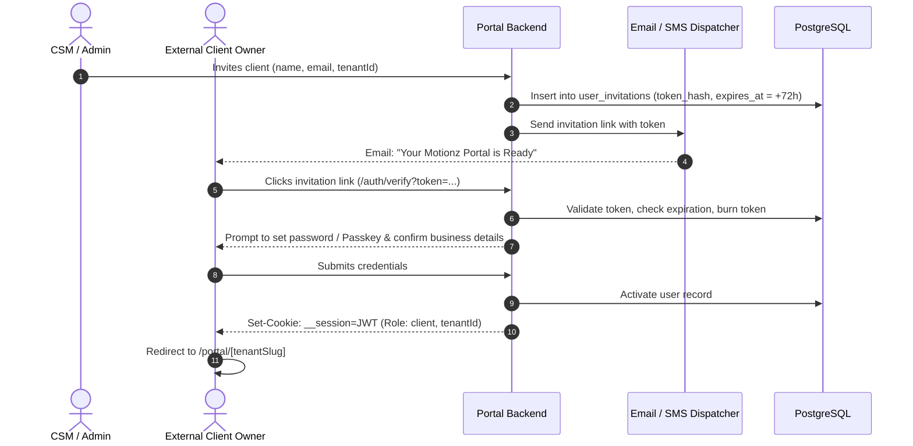

# Phase 3: Authentication & Access Implementation

This document details the authentication lifecycles, token issuance mechanisms, and credential verification procedures for the **Motionz Onboarding Portal**.

---

## 1. Authentication Lifecycles

### 1.1. Internal Staff (Admin & CSM) Login Lifecycle


### 1.2. External Client & Team Member Invitation Lifecycle


---

## 2. Magic Link Specifications

- **Token Cryptography**: 256-bit cryptographically secure random bytes generated via `crypto.randomBytes(32).toString('hex')`.
- **Database Storage**: The raw token is hashed using SHA-256 before insertion into `auth_tokens`.
- **Expiration Thresholds**:
  - **New Client Invitation**: 72 Hours (3 days).
  - **Self-Serve Login Request**: 15 Minutes.
- **Single-Use Invalidation**: Upon receipt, the token is flagged `used_at = NOW()`. Subsequent attempts trigger an immediate `401 Unauthorized` with security logging.

---

## 3. Session Cookie Configuration

All authenticated responses issue sessions through strict security cookie flags:
```typescript
export const SESSION_COOKIE_OPTIONS: CookieOptions = {
  name: '__motionz_session',
  httpOnly: true,
  secure: process.env.NODE_ENV === 'production',
  sameSite: 'lax',
  path: '/',
  maxAge: 60 * 60 * 24 * 7, // 7 days persistent session
};
```

---

## 4. Session Revocation & Logout

- **Standard Logout**: Clears the `__motionz_session` cookie and records an audit log entry.
- **Global Invalidation**: When a user's password is changed or an account is compromised, the `token_version` counter on `users` is incremented. Existing JWTs possessing an outdated version counter are immediately rejected by middleware.
