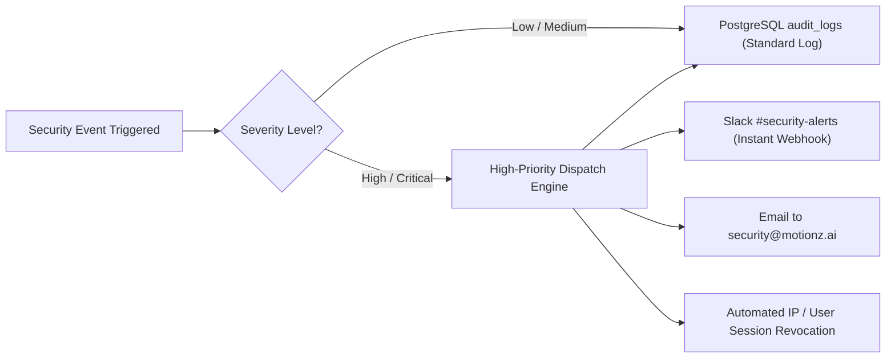

# Phase 3: Security Events & Audit Logging

The security monitoring subsystem tracks all critical security events, anomalies, and administrative actions to satisfy enterprise compliance and proactive threat detection.

---

## 1. Security Event Catalog

| Event Code | Event Name | Severity | Description | Trigger Condition |
| :--- | :--- | :--- | :--- | :--- |
| `SEC-001` | `auth.login_success` | Low | Successful login | User verifies credentials / magic link |
| `SEC-002` | `auth.login_failed` | Medium | Authentication failure | Invalid password, expired magic link |
| `SEC-003` | `auth.brute_force_blocked` | High | IP / Account locked | 5 failed login attempts in 10 minutes |
| `SEC-004` | `tenant.cross_tenant_probe` | Critical | Cross-tenant access attempt | User attempts to access a different tenant's URL |
| `SEC-005` | `role.privilege_escalation` | Critical | Unauthorized permission attempt | Client user requests an Admin API route |
| `SEC-006` | `portal.impersonation_start` | Medium | Staff views portal as client | Admin / CSM initiates View-As mode |
| `SEC-007` | `portal.deleted` | High | Client portal deleted | Admin executes soft/hard portal deletion |
| `SEC-008` | `data.ssn_revealed` | High | SSN or tax ID viewed | Staff views unmasked tax details |
| `SEC-009` | `integration.key_modified` | High | API credentials altered | GHL or external secret updated |

---

## 2. Automated Alert Dispatching Pipeline



### 2.1. Critical Alert Slack Payload Example
```json
{
  "text": "🚨 CRITICAL SECURITY ALERT: Cross-Tenant Probe Detected",
  "blocks": [
    {
      "type": "header",
      "text": { "type": "plain_text", "text": "🚨 Security Alert: SEC-004" }
    },
    {
      "type": "section",
      "fields": [
        { "type": "mrkdwn", "text": "*Actor:* user@client-a.com" },
        { "type": "mrkdwn", "text": "*Assigned Tenant:* Client A (Apex)" },
        { "type": "mrkdwn", "text": "*Target Tenant:* Client B (Metro)" },
        { "type": "mrkdwn", "text": "*Path:* `/portal/metro/contracts/12`" },
        { "type": "mrkdwn", "text": "*Action:* Blocked (403 Forbidden)" },
        { "type": "mrkdwn", "text": "*IP Address:* 198.51.100.42" }
      ]
    }
  ]
}
```
