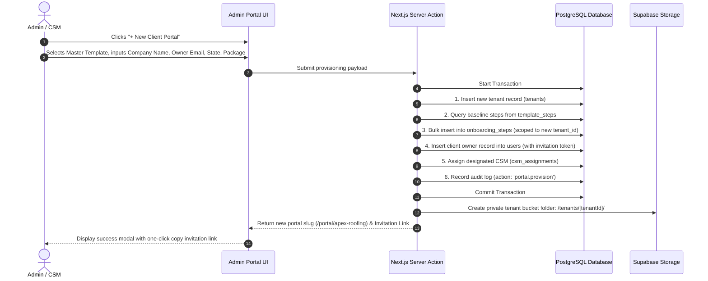
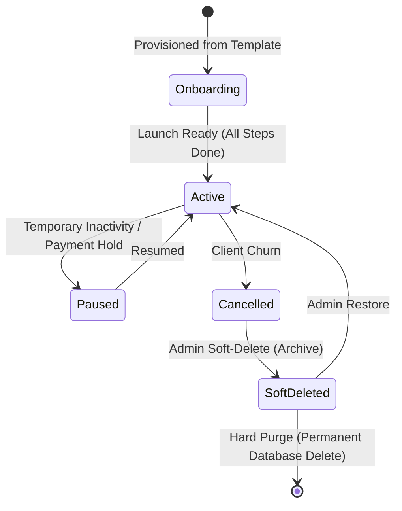

# Phase 4: Client Management & Provisioning Workflows

This document specifies the operational workflows for creating, customizing, managing, and archiving client portals.

---

## 1. Client Provisioning Sequence (From Master Template)

The creation of a new client portal is automated via the **Template Cloner**:

---

## 2. Client Profile & Configuration Overrides

Admins can customize any provisioned portal via the **Client Settings Panel**:
- **Business Identity**: Company legal name, DBA, address, city, state, postal code.
- **Assigned CSM**: Change or reassign primary CSM.
- **GoHighLevel Integration**: Configure Sub-Account Location ID and API Key.
- **Custom Links**: Set custom website URL, booking calendar URL, and tracking sheet URL.
- **LLC & Tax Data**: View state filing status, EIN, and state file number.
- **Package Tier**: Select package name and set lead quota limits.

---

## 3. Portal Lifecycle States

- **Soft-Delete Safeguard**: Deleting a portal flags `deleted_at = NOW()`. The portal immediately becomes inaccessible to clients and CSMs, but records are retained for **30 days** before permanent purge.
