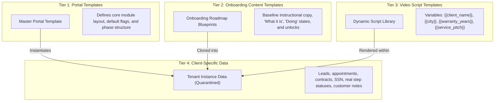

# Phase 4: Master Portal Template Engine

The template system is a core architectural requirement, enabling Motionz to scale across hundreds of client portals without manual coding.

---

## 1. Separation of Concerns: The Four Data Tiers

To prevent coupling and data corruption, the system enforces strict boundaries between four distinct categories of data:

| Data Tier | Ownership | Scope | Mutability |
| :--- | :--- | :--- | :--- |
| **1. Portal Templates** | Platform Admins | Global | Versioned; changes do not overwrite existing tenant records automatically |
| **2. Onboarding Content** | Admins & CSMs | Template or Tenant | Default copy cloned into tenant; CSM can customize per client |
| **3. Video Script Templates** | Content Team / Admin | Global Library | Rendered dynamically with client variables |
| **4. Client-Specific Data** | Client & Assigned CSM | Strict Tenant ID | Private to tenant; never shared or exported to templates |

---

## 2. Template Versioning & Selective Propagation

When an Admin updates a Master Portal Template (e.g. adding a new onboarding step or updating instructional copy for A2P texting):
1. The template version increments (e.g. `v1.2.0` -> `v1.3.0`).
2. **Selective Propagation Modal**: The Admin can choose:
   - *Option A: New Portals Only* — Existing client portals remain unchanged.
   - *Option B: Push Additive Steps to Active Portals* — Injects the new step into existing portals whose status is not yet `done`, preserving all existing client step statuses and notes.
   - *Option C: Force Update Instructional Copy* — Updates the "What it is" and "Doing" guidance text across selected client portals while strictly preserving statuses and form answers.
