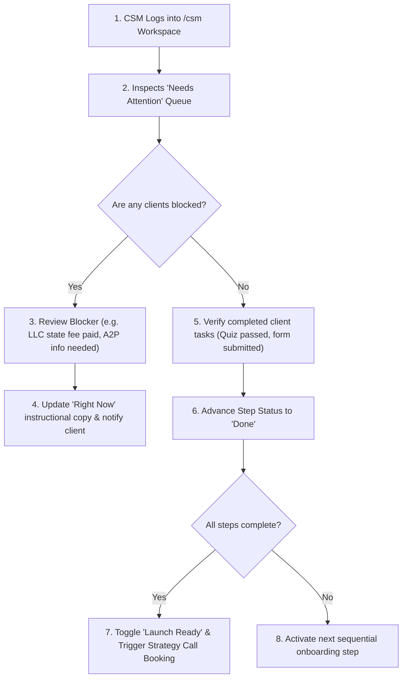

# Phase 5: CSM Operational Workflows & Playbooks

This document outlines the standard operational playbooks and daily execution workflows for Customer Success Managers (CSMs).

---

## 1. Daily Onboarding Management Workflow

---

## 2. Standard Playbooks by Onboarding Milestone

### Playbook A: LLC Filing & EIN Issuance
1. **Trigger**: Client clicks `"Start my LLC filing"` and completes the state filing checkout.
2. **CSM Action**:
   - CSM receives Slack alert: `LLC Filing Requested: [Client Name] ([State])`.
   - CSM initiates filing with state filing partner.
   - CSM updates step status to `In Progress` and updates `doing_text`:
     `"Filing submitted to state on [Date]. State approval typically takes 3-5 business days. EIN issuance will follow automatically."`
3. **Completion**: Once filing certificate and EIN letter arrive, CSM uploads PDFs to the client's `Contracts & Legal` repository and marks step status as `Done`.

### Playbook B: GoHighLevel CRM & A2P Texting Setup
1. **Trigger**: Client completes legal entity formation and provides trade name.
2. **CSM Action**:
   - CSM provisions GoHighLevel sub-account from Motionz agency snapshot.
   - CSM links GHL Location ID to the client portal in settings.
   - CSM submits A2P 10DLC brand and campaign registration.
   - CSM sets status to `In Progress` with note: `"A2P registration submitted to carriers. Carrier vetting in progress."`
3. **Completion**: Upon carrier approval, CSM marks step `Done`, unlocking live CRM texting and the performance metrics dashboard.

### Playbook C: Product Order & Shipping
1. **Trigger**: Client scores 20/20 on Applicator Certification Quiz.
2. **CSM Action**:
   - Verify certification in quiz responses.
   - Confirm delivery address on client profile.
   - Transmit order to chemical manufacturer.
   - Create order record in portal: carrier, tracking number, and tracking URL.
   - Status updates automatically as carrier webhook progresses from `Ordered` -> `Shipped` -> `Delivered`.
