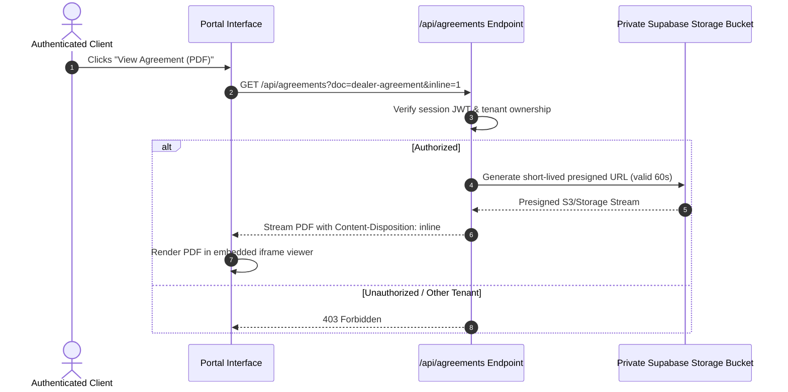

# Phase 6: Client Portal — Contracts & Legal Document Repository

The Contracts module provides a secure, private document vault for client owners to access signed dealer agreements and official state formation certificates.

---

## 1. Document Categories & Classifications

| Document Category | Example Title | Source | Access Scope |
| :--- | :--- | :--- | :--- |
| **Signed Agreement** | `Executed Dealer Agreement` | Uploaded by Admin upon contract execution | Client Owner only (toggle for members) |
| **State Articles** | `Articles of Organization` | Ingested upon state filing approval | Client Owner & Team |
| **Tax Confirmation** | `IRS EIN Issuance Notice (CP 575)` | Ingested upon IRS tax ID assignment | Client Owner only |
| **Good Standing** | `Certificate of Good Standing` | State Secretary of State record | Client Owner & Team |
| **Insurance Binder** | `Commercial General Liability Binder`| Uploaded by Client or CSM | Client Owner & Team |

---

## 2. Secure Document Streaming & PDF Viewer

Documents contain sensitive legal and tax identifiers and must never be exposed via public static URLs.

---

## 3. UI Implementation & Download Controls

- **Inline Document Switcher**: When multiple LLC certificates exist, tabs allow instant toggling between `Articles of Organization`, `EIN Confirmation`, and `Operating Agreement`.
- **Desktop View**: Renders the document directly within a responsive `<iframe src="/api/agreements?...#toolbar=0&navpanes=0">` container (height: 70vh) with white canvas backing.
- **Download Action**: Direct button (`⬇ Download PDF`) prompts native browser file save with standardized naming:
  `[business-name]_articles_of_organization.pdf`.
