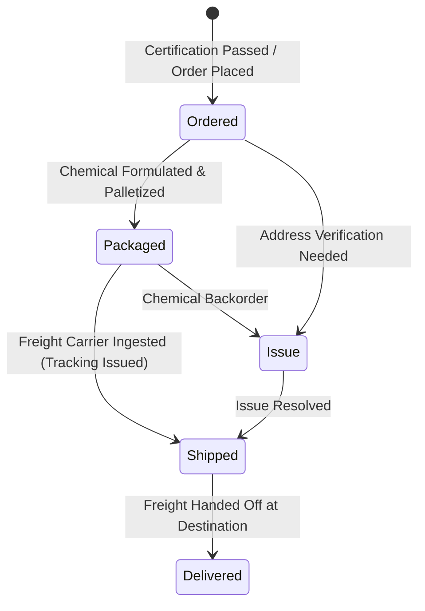

# Phase 6: Client Portal — Orders & Product Shipping Tracker

The Orders module provides live tracking for chemical product deliveries, ensuring dealers know exactly when their treatment solution is arriving.

---

## 1. Fulfillment Pipeline Stages

Product orders progress through five standardized stages:

---

## 2. Visual Stage Tracker Component

The portal renders a clean, mobile-responsive node tracker:
- **Completed Nodes**: Emerald dot (`#3FB97C`) with white checkmark (`✓`).
- **Active Node**: Pulsing cyan ring (`#34A5CB`) with inner indicator (`●`).
- **Upcoming Nodes**: Muted grey outline with dashed connectors.
- **Issue Flag**: If `stage === 'issue'`, the active node turns amber (`#E0A63A`) with warning guidance:
  `"There is a shipping detail our team is sorting out. No action needed from you unless we reach out."`

---

## 3. Order Data Card Attributes

- **Order Label**: Description of contents (e.g. `"Initial Product Order — 120 Gallons Concentrate"`).
- **Last Updated Date**: Formatted date indicating when the manufacturer updated order telemetry.
- **Carrier Name**: Freight provider (e.g. `FedEx Freight`, `R+L Carriers`, `Old Dominion`).
- **Tracking Number**: One-click selectable tracking number with clickable link to carrier portal.
- **Delivery Address Confirmation**: Confirms destination warehouse or commercial address.
