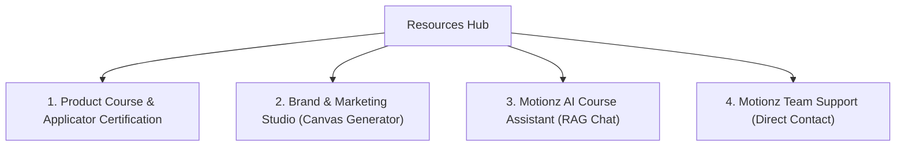

# Phase 6: Client Portal — Tools, Resources & Brand Studio

The Tools & Resources hub houses operational utilities, marketing generators, and applicator certification courses.

---

## 1. Hub Navigation & Resource Cards

The Resources dashboard renders four primary gateways:

---

## 2. Brand & Marketing Studio Specifications

The Brand Studio allows dealers to generate high-resolution marketing assets directly in the browser without graphic design software:

### 2.1. Dynamic Canvas Rendering Engine
- Renders social media posts (1080x1080), stories (1080x1920), print door-hangers (4.25"x11"), vehicle magnets (24"x12"), and apparel art on an HTML5 `<canvas>`.
- Automatically incorporates the client's business legal name, owner name, phone number, and brand accent color.
- Transparent PNG output for shirt and merchandise print files.

### 2.2. Visual Editor & AI Copywriter
- Allows the dealer to swap background photography from a shared library or upload real job photos.
- **AI Copywriter**: Dealers type a simple brief (e.g. `"fall special, free roof inspection"`) and the AI generates catchy, professional headlines and supporting copy.

### 2.3. AI Photo Studio (Inpainting & Generative Fill)
- Interactive canvas with brush and eraser tools.
- Dealers paint over specific portions of a photo (e.g. replacing an old faded shingle with rich dark shingles or making a cloudy sky bright blue).
- Employs mask coordinates and text prompts to output refined marketing imagery.

### 2.4. Direct Social Publishing (Ayrshare Integration)
- Dealers link their business Facebook Page and Instagram accounts once.
- Clicking `"Post now"` directly renders the canvas into high-res JPEG and publishes it to linked social feeds with custom captions.

### 2.5. Marketing Pack Downloads
- Direct access to ready-to-post graphics library (before/afters, educational carousels, video reels, copy-paste captions, and a 4-week posting calendar).
