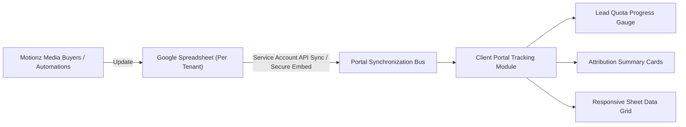

# Phase 6: Client Portal — Campaign Tracking & Attribution

The Tracking module gives clients transparent, real-time visibility into campaign delivery, lead attribution, and monthly quota consumption.

---

## 1. Tracking Sheet Architecture

Client campaign metrics are maintained in synchronized Google Sheets managed by the Motionz media buying team:

---

## 2. Lead Quota Progress Gauge

Every client package tier includes a 30-day monthly lead commitment:
- **Progress Bar**: Displays `C.quota.used / C.quota.quota leads` delivered in the trailing 30 days.
- **Color Dynamism**:
  - Pacing under 100%: Gradient bar (`#E8734A` to `#F2A65A`).
  - Quota Reached: Emerald green (`#7BC98B`) with celebration badge: `"Quota reached 🎉"`.
- **Explanatory Context**: Clearly informs the client: `"Leads delivered in the last 30 days, counted against your package's monthly lead quota."`

---

## 3. Responsive Data Grid Display

On desktop displays, tracking sheets are rendered via a high-performance, sandboxed `<iframe>` or parsed data table:
- **Desktop**: Full multi-column view with freeze headers (Date, Lead Name, Phone, City, Source Ad, Cost per Lead).
- **Mobile (<=768px)**: Horizontal scroll container with optimized touch gestures and condensed summary metric tiles above the grid.
