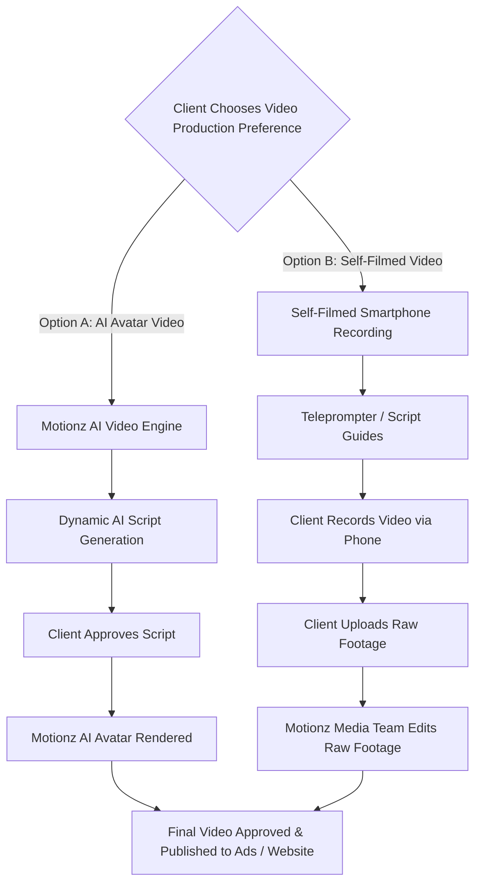

# Phase 6: Client Portal — Video Production & Script System

The Video Scripts module empowers clients to produce branded video marketing assets by choosing between AI avatar generation and self-filmed video production.

---

## 1. Production Preference Engine

Clients select their preferred video workflow during onboarding:

---

## 2. Dynamic Script Generation Engine

The portal maintains a library of high-converting roofing video scripts populated with tenant-specific variables:

### 2.1. Template Variable Replacement Tokens
- `{{client_name}}`: Business legal or trade name (e.g. `"Apex Roof Restoration"`).
- `{{owner_name}}`: Primary client owner name (e.g. `"Stephen"`).
- `{{city}}` / `{{state}}`: Operational market (e.g. `"Columbus, Ohio"`).
- `{{phone}}`: Provisioned A2P tracking number.
- `{{warranty_years}}`: Warranty guarantee (e.g. `"5-year transferable warranty"`).

### 2.2. Standard Script Categories
1. **The Hook & Problem (Direct Response Ad)**: Addresses homeowner concerns over expensive $15,000+ roof replacements vs $1,500 rejuvenation.
2. **The Science & Process**: Explains asphalt shingle oil depletion, petrochemical replenishment, and granular retention.
3. **The Local Trust & Offer**: Introduces the local owner, highlights recent neighborhood jobs, and offers a free 15-minute roof inspection.

---

## 3. Approval & Asset Handover

- **Client Approval**: Clients review scripts with an inline editor. Clicking `"Approve Script"` locks the text and alerts the Motionz video production team.
- **Upload Portal for Self-Filmed Videos**: Drag-and-drop video upload widget supporting `.mp4` and `.mov` up to 2GB directly into private cloud storage.
