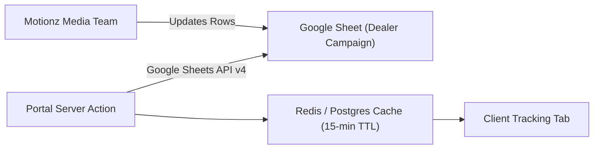

# Phase 7: Google Sheets API Integration Specification

The Google Sheets integration connects client portals with live campaign attribution spreadsheets managed by Motionz media buyers.

---

## 1. Authentication & Service Account Topology

- **Authentication Method**: Google Cloud Service Account with standard JSON Key credentials stored in Vercel environment variables (`GOOGLE_SERVICE_ACCOUNT_JSON`).
- **Scopes**: Read-only access (`https://www.googleapis.com/auth/spreadsheets.readonly`).
- **Sheet Sharing**: Client spreadsheets are shared with the service account email (e.g. `sync-bot@motionz-portal.iam.gserviceaccount.com`).

---

## 2. Data Extraction & Mapping

The sync service parses specific tabular ranges from the tracking sheet:
- **Range**: `'Tracking!A2:H100'`
- **Column Schema**:
  - `A`: Date of lead acquisition
  - `B`: Lead Full Name
  - `C`: Contact Telephone
  - `D`: City / Target ZIP Code
  - `E`: Source Platform (Facebook, Google, TikTok)
  - `F`: Campaign / Ad Set Name
  - `G`: Inspection Status (Pending, Completed, Sold)
  - `H`: Closed Job Value ($)

---

## 3. Caching & Rate Limit Mitigation

To prevent exhausting Google Sheets API rate limits (300 requests/minute per project):
- Synchronized records are cached in PostgreSQL or Redis with a **15-minute Time-To-Live (TTL)**.
- Manual refresh button in the portal enforces a 60-second cooldown per user.
