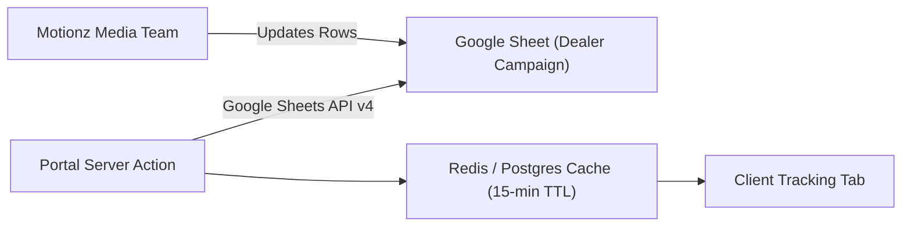

# Google Sheets and Drive: client Google files

> **This first part is what is built and running.** The "Phase 7" specification further down is the
> original design (service account, read-only sync) and is kept for reference only.

## What happens

When an admin adds a client, the portal calls a Google Apps Script web app
(`scripts/google-apps-script/create-client-sheet.gs`, called from `src/lib/integrations/sheets/provision.ts`).
The script gives every client their own Drive folder inside one parent folder:

```
<parent folder>                       (script property FOLDER_ID)
└── <Client>                          one folder per client, named after the client
    ├── <Client> - Tracking                copy of the tracking template (TEMPLATE_ID)
    └── <Client> - Money Leak Calculator   copy of the calculator template (CALCULATOR_TEMPLATE_ID)
```

- Both files are shared with the client's email as **editor**.
- The portal saves the links in the client's `google_sheets` integration config:
  `folder_id`, `folder_url`, `spreadsheet_id`, `sheet_url`, `calculator_id`, `calculator_url`.
- The client's **Results Tracking** page embeds their own tracking sheet and their own calculator
  (opened on the calculator tab, `gid=2143281968`; copies keep the tab ids of the template).
  A client without a calculator copy yet sees "Your calculator is being set up". The portal never shows a shared calculator.
- The Drive folder link is for staff only (admin client page). It is not sent to the client portal.
- **Renaming a client** (Admin > client > Company name > Save) renames the folder and both files.
  File ids and links do not change. If Drive cannot be reached the save still succeeds and the page
  shows "Saved. The Google Drive folder could not be renamed: …".
- Two clients with the same name never share a folder: the second gets "<Client> (2)".

## Clients created before per-client folders

Open Admin > Clients > the client. Under **Company details > Google files** press
**Finish Google files setup** (or **Set up Google files** when nothing exists yet). This:

1. creates the client folder,
2. **moves** the existing tracking sheet into it (same file, same link, nothing is duplicated),
3. creates the client's calculator copy and shares it.

It is safe to press again; it reuses what already exists. The button disappears once the tracking
sheet, calculator and Drive folder are all there.

## Script properties (Apps Script > Project Settings > Script Properties)

| Property | Value |
|---|---|
| `SHARED_SECRET` | Same value as `GOOGLE_SHEETS_SCRIPT_SECRET` in the portal |
| `TEMPLATE_ID` | Id of the tracking template sheet |
| `CALCULATOR_TEMPLATE_ID` | **New.** Id of the Money Leak Calculator template: `1pDXSCpnGIJXLnXheL-yQofUWvZ8mSDk-YM6nLl_pZrw` |
| `FOLDER_ID` | Id of the parent Drive folder that holds the client folders |

Portal environment variables are unchanged: `GOOGLE_SHEETS_SCRIPT_URL` and `GOOGLE_SHEETS_SCRIPT_SECRET`.

If `CALCULATOR_TEMPLATE_ID` is missing, clients are still created with their tracking sheet and the
admin sees "the calculator was not created"; press **Finish Google files setup** after adding the property.

## Redeploy steps for the script owner (keeps the same web-app URL)

Do these in order, signed in as the Google account that owns the script:

1. Open the Apps Script project.
2. Replace **all** the code with the contents of `scripts/google-apps-script/create-client-sheet.gs` and save.
3. **Project Settings** (gear icon) > **Script Properties** > **Add script property**:
   `CALCULATOR_TEMPLATE_ID` = `1pDXSCpnGIJXLnXheL-yQofUWvZ8mSDk-YM6nLl_pZrw` > **Save script properties**.
4. **Deploy** > **Manage deployments** > select the existing deployment > **Edit** (pencil) >
   **Version: New version** > **Deploy**. The web-app URL stays the same, so the portal needs no change.
   (Do not use "New deployment": that creates a different URL.)
5. Back in the editor choose the function **testSetup** in the toolbar > **Run** > approve the Google Drive
   permission prompt. The log shows three links: a "Setup Test" folder, its tracking sheet and its calculator.
   Open them to check, then delete the "Setup Test" folder.

The script owner's account must be able to edit the parent folder and open both templates, and must own
(or be able to edit) the tracking sheets created earlier, otherwise they cannot be moved into the new folders.

The new script still answers the old request format, so it can be redeployed **before** the new portal
version goes live. The new portal also works against the old script (tracking sheet only, with a
"calculator was not created" warning), so the order of the two deployments does not matter.

## Staging and production

On staging the script runs under the developer's Google account (it owns the files it creates).
For production it must be deployed again under the **client's** Google account: new Apps Script project,
their own templates and parent folder, a new `SHARED_SECRET`, **Deploy > New deployment > Web app**
(Execute as "Me", Who has access "Anyone"), then put the new URL and secret in the production
`GOOGLE_SHEETS_SCRIPT_URL` / `GOOGLE_SHEETS_SCRIPT_SECRET`.

---

# Phase 7: Google Sheets API Integration Specification (original design, not built)

The Google Sheets integration connects client portals with live campaign attribution spreadsheets managed by Motionz media buyers.

---

## 1. Authentication & Service Account Topology

- **Authentication Method**: Google Cloud Service Account with standard JSON Key credentials stored in Vercel environment variables (`GOOGLE_SERVICE_ACCOUNT_JSON`).
- **Scopes**: Read-only access (`https://www.googleapis.com/auth/spreadsheets.readonly`).
- **Sheet Sharing**: Client spreadsheets are shared with the service account email (e.g. `sync-bot@motionz-portal.iam.gserviceaccount.com`).



---

## 2. Data Extraction & Mapping

The sync service parses specific tabular ranges from the tracking sheet:
- **Range**: `'Tracking!A2:H100'`
- **Column Schema**:
  - `A`: Date of lead acquisition
  - `B`: Lead Full Name
  - `C`: Contact Telephone
  - `D`: City / Target ZIP Code
  - `E`: Source Platform (Facebook, Google, TikTok)
  - `F`: Campaign / Ad Set Name
  - `G`: Inspection Status (Pending, Completed, Sold)
  - `H`: Closed Job Value ($)

---

## 3. Caching & Rate Limit Mitigation

To prevent exhausting Google Sheets API rate limits (300 requests/minute per project):
- Synchronized records are cached in PostgreSQL or Redis with a **15-minute Time-To-Live (TTL)**.
- Manual refresh button in the portal enforces a 60-second cooldown per user.
