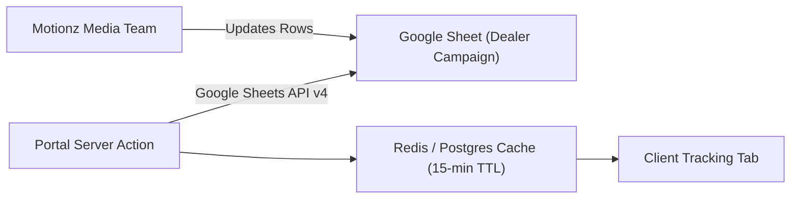

# Google Sheets and Drive: client Google files

> **This first part is what is built and running.** The "Phase 7" specification further down is the
> original design (service account, read-only sync) and is kept for reference only.

## What happens

When an admin adds a client, the portal calls a Google Apps Script web app
(`scripts/google-apps-script/create-client-sheet.gs`, called from `src/lib/integrations/sheets/provision.ts`).
The script gives every client their own Drive folder inside one parent folder:

```
<parent folder>                       (script property FOLDER_ID)
└── <Client>                          one folder per client, named after the client
    ├── <Client> - Tracking                copy of the tracking template (TEMPLATE_ID)
    └── <Client> - Money Leak Calculator   copy of the calculator template (CALCULATOR_TEMPLATE_ID)
```

- Both files are shared with the client's email as **editor**. Who else can open what is decided by the
  portal's people; see **Who can open the files** below.
- A contract file uploaded by an admin is saved in the same client folder (see **Contract files**).
- The portal saves the links in the client's `google_sheets` integration config:
  `folder_id`, `folder_url`, `spreadsheet_id`, `sheet_url`, `calculator_id`, `calculator_url`.
- The client's **Results Tracking** page embeds their own tracking sheet and their own calculator
  (opened on the calculator tab, `gid=2143281968`; copies keep the tab ids of the template).
  A client without a calculator copy yet sees "Your calculator is being set up". The portal never shows a shared calculator.
- The Drive folder link is for staff only (admin client page). It is not sent to the client portal.
- **Renaming a client** (Admin > client > Company name > Save) renames the folder and both files.
  File ids and links do not change. If Drive cannot be reached the save still succeeds and the page
  shows "Saved. The Google Drive folder could not be renamed: …".
- Two clients with the same name never share a folder: the second gets "<Client> (2)".

## Who can open the files (Drive access follows the portal)

Access is always given to **named email addresses**. Nothing is ever shared as "anyone with the link";
the script has no code that can do that. The rules live in one function, `desiredDriveAccess()` in
`src/lib/integrations/sheets/access.ts`:

| Who (in the portal) | Gets | On |
|---|---|---|
| Admin (active) | Editor | The **parent folder**. Drive passes this down to every client folder and file. |
| The client's assigned CSM (active) | Editor | **That client's folder** (and so everything in it). |
| Client owner (active) | Editor | The **tracking sheet** and the **calculator**. Not the folder. |
| Client owner (active) | Viewer | Each **uploaded contract file**. |
| Team member (active) who may see Results Tracking, or has no restriction list | Editor | The **tracking sheet** and the **calculator**. Never the contract. |
| Team member without Results Tracking | Nothing | |
| Anyone disabled or deleted | Nothing (removed) | |
| Owner and team of a suspended, cancelled or archived client | Nothing (removed) | Staff keep their access. |

Details worth knowing:

- **Before the owner has accepted their invitation** the client's main email stands in for them, so the
  sheets are shared from the day the client is added (as before).
- Emails are compared without regard to upper/lower case.
- **The Google account that runs the script, and the owner of a file, are never changed.**
- **Client folders and files are kept exactly in step:** someone added by hand in Google Drive to a client
  folder, sheet or contract is removed at the next sync. Add people in the portal, not in Drive.
- **The parent folder is handled more carefully:** only people the portal knows (current or former staff,
  any `@motionz.ai` address, an old email of a staff member) are ever taken off it. Someone the Drive
  owner shared the parent folder with by hand stays. Remove them in Drive if they should not be there.
- A person who reaches a file through the folder above it (an admin through the parent folder, the CSM
  through the client folder) is left alone on the file itself.

### When the sync runs

`syncClientDriveAccess(tenantId)` asks the script who has access now (`list_access`), works out the
difference and sends only that (`set_access`). It runs after:

- a client is added; **Set up Google files** / **Finish Google files setup**;
- a client owner or team member **accepts their invitation** (that is when they get a login);
- a team member is disabled, enabled, or their pages are changed (by the owner in the portal, or by an admin);
- the **assigned CSM** is changed;
- a client is suspended, reactivated, archived or unarchived;
- a staff member is added, has their email or role changed, is disabled, enabled or deleted
  (`syncStaffDriveAccess`: the parent folder, plus the folders of a CSM's clients in one round trip);
- a contract file is uploaded.

It never fails the action that triggered it. A Drive problem comes back as a warning
(`driveAccessWarning` in the API answer) and one **"Google Drive access updated"** entry in the Audit Log
(`drive.access_synced`, written only when something changed or went wrong).

**Re-sync Drive access** (Admin > client > Company details > Google files) runs it by hand and shows
"Access is up to date", "Added 2, removed 1", or the warning. It is safe to press at any time.

### What people receive from Google

- When someone is **given** access, Google emails them "<script owner> shared a folder/file with you"
  from the script owner's Google account. This is Google's own email; the portal cannot change its wording.
- When access is **removed**, Google sends nothing.
- The address must be able to sign in to Google. A Gmail or Google Workspace address works straight away.
  For another address (Outlook, a company mailbox without Google), Google may ask the person to confirm
  with a code sent to that email each time they open the file, or it may refuse the share. A refusal shows
  as a warning naming the address ("Could not give … access to the tracking sheet: …"); everyone else is
  still handled. The fix is for that person to create a Google account with the same email, then press
  **Re-sync Drive access**.
- The sheets embedded on Results Tracking only load when the person's browser is signed in to Google with
  the email they use for the portal.

## Contract files

Admin > client > **Contract** offers two ways to attach a contract:

- **Upload a file**: PDF, DOCX, PNG or JPG, up to 4 MB (checked by type and by content). The file is saved
  in the client's Drive folder (`upload_file`), the link is saved as the contract's document link, and the
  account owner is given **viewer** access by the sync. Staff reach it through the folder. The client's
  Contract page says "Opens in Google Drive. Sign in to Google with <owner email> to view it."
- **Paste a link**: any `https://` link (DocuSign and similar). Works as before; Google is not involved.

The client must have a Drive folder. Without one the upload answers: "This client has no Google Drive
folder yet. Press "Set up Google files" under Company details first, then upload the contract again."

An uploaded contract remembers its Drive file in the existing `contracts.storage_path` column as
`gdrive:<fileId>` (the API shows it as `drive_file_id`). **No database change is needed.**
Removing an uploaded contract moves the file to the bin in Drive (`trash_file`, which first takes its
viewers off); removing a link contract touches nothing in Drive.

## Clients created before per-client folders

Open Admin > Clients > the client. Under **Company details > Google files** press
**Finish Google files setup** (or **Set up Google files** when nothing exists yet). This:

1. creates the client folder,
2. **moves** the existing tracking sheet into it (same file, same link, nothing is duplicated),
3. creates the client's calculator copy and shares it.

It is safe to press again; it reuses what already exists. The button disappears once the tracking
sheet, calculator and Drive folder are all there.

### All older clients at once (one-off script)

`scripts/setup-google-files.ts` does the same as the button for every client that is not archived.
It reads `.env.local`, so it works on whichever database that file points to.

```
npx tsx scripts/setup-google-files.ts --dry-run          # only lists each client and what is missing
npx tsx scripts/setup-google-files.ts                    # sets up whatever is missing
npx tsx scripts/setup-google-files.ts --only=<tenantId>  # one client only
npx tsx scripts/setup-google-files.ts --sync-access      # also make Drive access match the portal's people
```

`--sync-access` runs after the setup: first the parent folder (admins), then every client, archived ones
included (their people lose access). Clients without a Drive folder are skipped. It prints one line per
client ("Access is up to date", "Added 2, removed 1", or the warning) and only changes what differs, so it
is safe to run again. It needs the updated Google script; with the old one it stops with a clear message.
It does nothing in a `--dry-run`.

- Run it **after** the Apps Script has been redeployed (steps below), otherwise only tracking sheets are handled.
- It refuses to start when `GOOGLE_SHEETS_SCRIPT_URL` or `GOOGLE_SHEETS_SCRIPT_SECRET` is not set.
- Clients that already have all three files are skipped. One client failing does not stop the others;
  a summary is printed at the end. It is safe to run again.

## Script properties (Apps Script > Project Settings > Script Properties)

| Property | Value |
|---|---|
| `SHARED_SECRET` | Same value as `GOOGLE_SHEETS_SCRIPT_SECRET` in the portal |
| `TEMPLATE_ID` | Id of the tracking template sheet |
| `CALCULATOR_TEMPLATE_ID` | **New.** Id of the Money Leak Calculator template: `1pDXSCpnGIJXLnXheL-yQofUWvZ8mSDk-YM6nLl_pZrw` |
| `FOLDER_ID` | Id of the parent Drive folder that holds the client folders |

Portal environment variables are unchanged: `GOOGLE_SHEETS_SCRIPT_URL` and `GOOGLE_SHEETS_SCRIPT_SECRET`.

If `CALCULATOR_TEMPLATE_ID` is missing, clients are still created with their tracking sheet and the
admin sees "the calculator was not created"; press **Finish Google files setup** after adding the property.

## What the script can be asked to do

Every request is a JSON POST with the shared `secret`. One request runs at a time (script lock).

| `action` | Sent | Answer | Notes |
|---|---|---|---|
| `provision` (default) | `clientName`, `clientEmail?`, `folderId?`, `trackingSheetId?`, `calculatorSheetId?` | `ok, folderId, folderUrl, spreadsheetId, url, calculatorId, calculatorUrl, warnings` | Unchanged. Safe to repeat. |
| `rename` | `clientName`, `folderId?`, `trackingSheetId?`, `calculatorSheetId?` | `ok, warnings` | Unchanged. |
| `list_access` | `ids` (up to 50) | `ok, version, parentFolderId, scriptUser, parent, items[]` each with `id, ok, owner, editors, viewers` | Reads only. Always includes the parent folder. This is how the portal learns the parent folder id and spots an old script. |
| `set_access` | `changes` (up to 100) of `{ id, email, role }`, role `editor`, `viewer` or `none` | `ok, results[]` each `{ id, email, role, ok, error? }` | One bad address does not stop the rest. Owner and script account are skipped. |
| `upload_file` | `folderId, name, mimeType, base64` (up to 6 MB) | `ok, fileId, url` | The folder must be inside the parent folder. |
| `trash_file` | `fileId` | `ok` | Only files inside the parent folder. Removes the file's viewers, then bins it. |

The four new actions only ever touch the parent folder and what is inside it, never read `clientName`,
and never change link sharing.

## Redeploy steps for the script owner (keeps the same web-app URL)

**Needed once for Drive access and contract uploads** (7 Oct 2026). Do these in order, signed in as the
Google account that owns the script:

1. Open the Apps Script project.
2. Replace **all** the code with the contents of `scripts/google-apps-script/create-client-sheet.gs` and save.
3. **Project Settings** (gear icon) > **Script Properties**: check the four properties in the table above are
   there. Nothing new is needed for this update.
4. **Deploy** > **Manage deployments** > select the existing deployment > **Edit** (pencil) >
   **Version: New version** > **Deploy**. The web-app URL stays the same, so the portal needs no change.
   (Do not use "New deployment": that creates a different URL.)
5. Back in the editor choose the function **testSetup** in the toolbar > **Run** > approve any permission
   prompt Google shows. The log shows three links (a "Setup Test" folder, its tracking sheet, its
   calculator), then `File upload: OK`, `Access actions: OK` and who the parent folder is shared with now.
   Only your own email is used; nobody else is emailed. Delete the "Setup Test" folder afterwards.
6. In the portal open any client > **Company details > Google files** > **Re-sync Drive access**. It should
   answer "Access is up to date" or "Added n…". To do every client at once, a developer runs
   `npx tsx scripts/setup-google-files.ts --sync-access`.

**Before you do step 6 the first time, read "Who can open the files" above:** the first sync emails every
admin, CSM and team member who is given access, and removes anyone who was added by hand to a client
folder or file.

The script owner's account must be able to edit the parent folder and open both templates, and must own
(or be able to edit) the tracking sheets created earlier, otherwise they cannot be moved into the new folders.
If the parent folder itself sits inside another shared folder, people who reach it from above show up in
its list; the portal leaves them alone unless they are portal staff.

### The order of the two deployments does not matter

- **New script, old portal:** the script still answers `provision` and `rename` exactly as before.
- **New portal, old script:** client creation, set-up and rename work as before. Every access sync answers
  with the warning **"The Google script needs updating before Drive access can be managed."** and changes
  nothing; a contract upload is refused with "The Google script needs updating before files can be
  uploaded. Paste a link instead for now." The portal recognises an old script because `list_access` (a
  read-only question that carries no `clientName`) does not come back with the expected fields; it never
  sends `set_access` to a script that failed that check.

## Staging and production

On staging the script runs under the developer's Google account (it owns the files it creates).
For production it must be deployed again under the **client's** Google account: new Apps Script project,
their own templates and parent folder, a new `SHARED_SECRET`, **Deploy > New deployment > Web app**
(Execute as "Me", Who has access "Anyone"), then put the new URL and secret in the production
`GOOGLE_SHEETS_SCRIPT_URL` / `GOOGLE_SHEETS_SCRIPT_SECRET`.

("Who has access: Anyone" is about who may *call* the web app; every call still needs the shared secret.
It has nothing to do with who can open the Drive files.) On staging, the "shared with you" emails come
from the developer's Google account; in production they will come from the client's.

---

# Phase 7: Google Sheets API Integration Specification (original design, not built)

The Google Sheets integration connects client portals with live campaign attribution spreadsheets managed by Motionz media buyers.

---

## 1. Authentication & Service Account Topology

- **Authentication Method**: Google Cloud Service Account with standard JSON Key credentials stored in Vercel environment variables (`GOOGLE_SERVICE_ACCOUNT_JSON`).
- **Scopes**: Read-only access (`https://www.googleapis.com/auth/spreadsheets.readonly`).
- **Sheet Sharing**: Client spreadsheets are shared with the service account email (e.g. `sync-bot@motionz-portal.iam.gserviceaccount.com`).



---

## 2. Data Extraction & Mapping

The sync service parses specific tabular ranges from the tracking sheet:
- **Range**: `'Tracking!A2:H100'`
- **Column Schema**:
  - `A`: Date of lead acquisition
  - `B`: Lead Full Name
  - `C`: Contact Telephone
  - `D`: City / Target ZIP Code
  - `E`: Source Platform (Facebook, Google, TikTok)
  - `F`: Campaign / Ad Set Name
  - `G`: Inspection Status (Pending, Completed, Sold)
  - `H`: Closed Job Value ($)

---

## 3. Caching & Rate Limit Mitigation

To prevent exhausting Google Sheets API rate limits (300 requests/minute per project):
- Synchronized records are cached in PostgreSQL or Redis with a **15-minute Time-To-Live (TTL)**.
- Manual refresh button in the portal enforces a 60-second cooldown per user.
