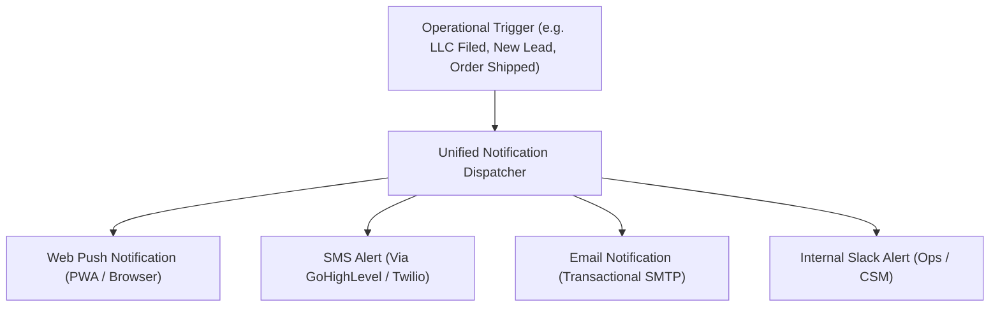

# Phase 7: Multi-Channel Notifications & Push Architecture

The notification engine delivers timely alerts across Web Push, SMS, and Email to ensure clients stay updated on onboarding progress, leads, and operational milestones.

---

## 1. Notification Channels & Topology



---

## 2. Web Push & PWA Architecture

- **Protocol**: Standard W3C Push API & PushManager using VAPID keys (`NEXT_PUBLIC_VAPID_PUBLIC_KEY` and `VAPID_PRIVATE_KEY`).
- **Service Worker (`sw.js`)**: Background event listener receives payloads and displays native system notifications:
  ```javascript
  self.addEventListener('push', event => {
    const data = event.data.json();
    self.registration.showNotification(data.title, {
      body: data.body,
      icon: '/icons/icon-192.png',
      badge: '/icons/badge-72.png',
      data: { url: data.url }
    });
  });
  ```
- **Mobile Safari Compatibility**: On iOS 16.4+, web push requires the portal to be added to the user's home screen. The portal automatically guides users through the installation flow before prompting for push permissions.

---

## 3. Subscription & Device Management

- Client push subscriptions are stored in the database:
  `push_subscriptions(id, user_id, tenant_id, endpoint, p256dh, auth, created_at)`.
- Users can toggle notifications on or off with a single click in their profile.
