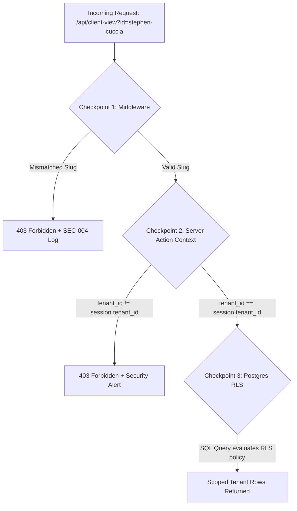

# Phase 9: Multi-Tenant Isolation & Leak Prevention

This document specifies the technical procedures and automated assertions used to verify multi-tenant isolation across all system layers.

---

## 1. Multi-Tenant Boundary Verification Model

To ensure absolute quarantine between client tenants, every request must pass through three verification checkpoints:



---

## 2. RLS Security Audit Queries

Database administrators run automated RLS sanity scripts during CI/CD to verify policies cannot be bypassed:

```sql
-- Automated Test 1: Verify Client A cannot see Client B's leads
BEGIN;
-- Set context to Client A
SET LOCAL app.current_tenant_id = '11111111-1111-1111-1111-111111111111';
SET LOCAL app.current_user_role = 'client';

-- Query all leads (attempting cross-tenant scan)
SELECT COUNT(*) FROM client_leads WHERE tenant_id = '22222222-2222-2222-2222-222222222222';
-- ASSERTION: Must return 0 rows.

ROLLBACK;
```

---

## 3. Storage Bucket Tenant Path Sandboxing

Private document storage enforces path-based prefix sandboxing:
- Objects are stored under `/tenants/{tenant_id}/contracts/{filename}.pdf`.
- Storage access policies verify that the downloading user's `tenant_id` claim strictly matches the storage path prefix.
- Direct object ID enumeration is impossible because storage paths use cryptographically random UUIDs.
