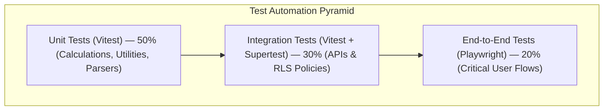
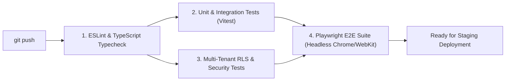

# Phase 10: Testing Strategy & Quality Assurance Framework

This document outlines the testing pyramid, automated CI/CD validation gates, and quality benchmarks for the **Motionz Onboarding Portal**.

---

## 1. Testing Pyramid & Coverage Targets

| Test Tier | Scope & Focus Areas | Target Coverage | Tooling |
| :--- | :--- | :---: | :--- |
| **Unit Tests** | Roof measure math, chemical ratios, pitch angles, template interpolation | > 85% | Vitest |
| **Integration Tests** | Next.js API routes, Server Actions, GoHighLevel client, RLS policies | > 80% | Vitest + PostgreSQL Test DB |
| **E2E Tests** | Admin provisioning, CSM status changes, client portal navigation | Core Flows | Playwright |
| **Security Tests** | IDOR cross-tenant assertions, magic link expiration, rate limits | 100% Critical Paths | Automated Security Suite |

---

## 2. CI/CD Pipeline Gates (GitHub Actions)

Every Pull Request must pass through four sequential verification gates:

---

## 3. Mobile & PWA Test Requirements

All PRs introducing UI changes must be verified across standard viewport breakpoints:
- **Mobile Handset**: iPhone 14/15 (390x844), Pixel 7 (412x915).
- **Tablet**: iPad Air (820x1180).
- **Desktop**: 1440x900 and 1920x1080.
- **PWA Verification**: Lighthouse PWA audit score $\ge 90$; Service Worker offline shell installation verified.
