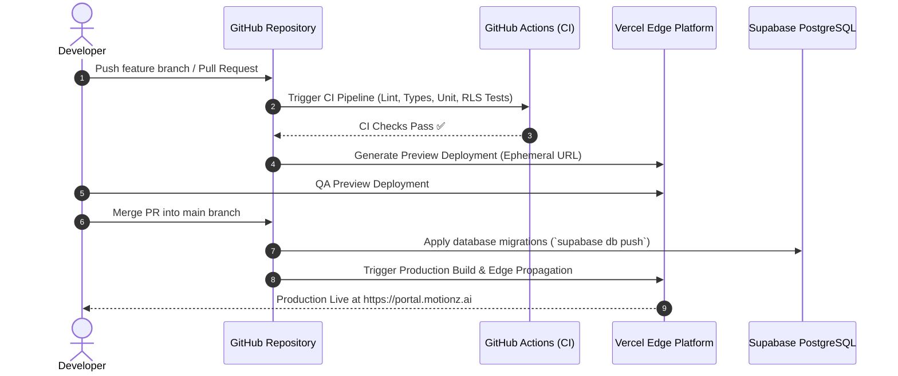

# Phase 11: Deployment Workflows & CI/CD Pipeline

This document defines the deployment pipeline, database schema migration procedures, and automated rollback strategies for the **Motionz Onboarding Portal**.

---

## 1. Continuous Deployment Pipeline (Vercel & GitHub)

---

## 2. Database Schema Migration Management

- **Migration Tooling**: Supabase CLI / Prisma Migrations.
- **Rules of Engagement**:
  1. All schema modifications are versioned in `supabase/migrations/YYYYMMDDHHMMSS_description.sql`.
  2. Migrations must be strictly backwards-compatible (expand-and-contract pattern) to ensure zero-downtime rolling deployments.
  3. Non-destructive DDL only: Columns are added as nullable or with defaults before application code consumes them; dropped columns are phased out over multiple releases.

---

## 3. Backup, Disaster Recovery & Instant Rollback

- **Automated PostgreSQL Backups**: Daily full physical backups retained for 30 days; continuous Write-Ahead Log (WAL) archiving enabling **Point-in-Time Recovery (PITR)** down to the second.
- **One-Click Vercel Rollback**: If an unhandled production exception occurs, Vercel allows instantaneous rollback to the prior immutable build artifact in under 10 seconds.
- **Health Checks & Telemetry**: `/api/health` endpoint verifies database connectivity, cache latency, and external integration heartbeats.
