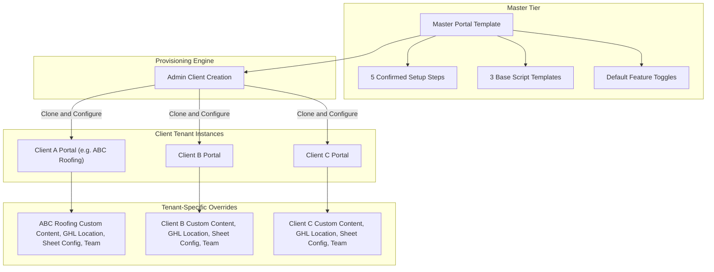

# Motionz Onboarding Portal Documentation Suite

Welcome to the architectural, engineering, and operational documentation suite for the Motionz Onboarding Portal (motionz.ai).

The Motionz Onboarding Portal is a private, multi-tenant web application between Motionz and Motionz Client Companies (such as roofing contractors and service providers). It enables Motionz administrators and Customer Success Managers (CSMs) to provision, customize, and oversee client portals derived from a Master Portal Template, while providing clients with a dedicated, mobile-first dashboard to track onboarding setup progress, leads, appointments, tracking sheets, signed contracts, physical orders, tools, roof measurement, and video script templates.

## Master Documentation Index

```
docs/
├── README.md                                  # Master Index and Architecture Overview
├── 00-project-definition/
│   ├── scope.md                               # System Scope, Inclusions and Out-of-Scope Items
│   ├── requirements.md                        # Functional and Non-Functional Requirements
│   ├── roles-and-permissions.md               # System Actors and Permission Matrix
│   ├── assumptions.md                         # Operational and Technical Assumptions
│   └── open-questions.md                      # Resolved and Active Architectural Decisions
├── 01-architecture/
│   ├── system-architecture.md                 # High-Level Architecture and Tech Stack
│   ├── application-architecture.md            # Next.js App Router Structure and Components
│   ├── multi-tenancy.md                       # Tenant Isolation Model and RLS Policies
│   ├── authentication.md                      # Auth Strategy and Magic Link Rules
│   ├── authorization.md                       # Route Guards and Capability Checks
│   ├── integrations.md                        # Integration Bus and Adapters
│   └── security-architecture.md               # Defense-in-Depth Security Controls
├── 02-database/
│   ├── data-model.md                          # Relational Data Architecture
│   ├── entities.md                            # Entity Specifications
│   ├── relationships.md                       # Foreign Keys and Constraints
│   └── erd.md                                 # Entity-Relationship Diagrams
├── 03-auth-and-access/
│   ├── authentication.md                      # Authentication Lifecycles
│   ├── roles.md                               # Role Hierarchy
│   ├── permissions.md                         # Capability Tokens
│   └── security-events.md                     # Security Auditing and Alerts
├── 04-admin/
│   ├── requirements.md                        # Admin System Requirements
│   ├── dashboard.md                           # Analytics and System Health
│   ├── client-management.md                   # Client Provisioning and Archival
│   ├── templates.md                           # Master Portal Template Engine
│   └── feature-toggles.md                     # Feature Flag Architecture
├── 05-csm/
│   ├── requirements.md                        # CSM Requirements and Boundaries
│   └── workflows.md                           # Setup Step Execution and Client Support
├── 06-client-portal/
│   ├── overview.md                            # Client Dashboard
│   ├── onboarding.md                          # Five Confirmed Setup Steps
│   ├── contracts.md                           # Signed Contract Viewer
│   ├── leads.md                               # Leads and Appointments Viewer
│   ├── tracking.md                            # Google Sheets Tracking Data
│   ├── tools.md                               # Utilities and Resources Directory
│   ├── orders.md                              # Product Order and Shipment Tracker
│   ├── roof-measurement.md                    # Roof Measurement Tool Adapter
│   ├── video-scripts.md                       # Template-Based Script Engine and Preference
│   └── profile-and-team.md                    # Company Profile and Team Invitations
├── 07-integrations/
│   ├── gohighlevel.md                         # GoHighLevel API, Leads, and Contracts
│   ├── google-sheets.md                       # Google Sheets API Sync
│   ├── slack.md                               # Slack Community Resource
│   ├── skool.md                               # Skool Training Resource
│   ├── forms.md                               # Embedded GHL and A2P Forms
│   └── booking.md                             # GoHighLevel Calendar Booking Embed
├── 08-ai-and-video/
│   └── video-workflow.md                      # Video Preferences and Template Scripts (AI Out of Scope)
├── 09-security/
│   ├── security-requirements.md               # Security Standards and OWASP Controls
│   ├── tenant-isolation.md                    # Multi-Tenant Leak Prevention
│   └── security-test-plan.md                  # Security Test Scenarios and IDOR Verification
├── 10-testing/
│   ├── test-strategy.md                       # QA Strategy and Testing Layers
│   ├── e2e.md                                 # Playwright End-to-End Test Specs
│   └── qa-checklist.md                        # Pre-Deployment Verification Checklist
├── 11-deployment/
│   ├── environments.md                        # Environment Topologies and Secrets
│   ├── deployment.md                          # Vercel Deployment and Supabase Migrations
│   └── production-checklist.md                # Production Readiness Gates
├── 12-handover/
│   ├── admin-guide.md                         # Admin Platform Operations Manual
│   ├── csm-guide.md                           # CSM Playbook and Client Guidance
│   ├── client-guide.md                        # Client User Manual
│   └── developer-guide.md                     # Engineering Setup and Contributing
└── implementation/
    ├── MASTER-TASKS.md                        # Master Implementation Tracker
    ├── DECISIONS.md                           # Architecture Decision Records (ADR-001 to ADR-010)
    ├── PHASE-00-AUDIT.md                      # Phase 00 Audit Tasks and Results
    ├── PHASE-01-FOUNDATION.md                 # Phase 01 Foundation Tasks
    ├── PHASE-02-DATABASE.md                   # Phase 02 Database Tasks
    ├── PHASE-03-AUTH-RBAC.md                  # Phase 03 Authentication Tasks
    ├── PHASE-04-ADMIN.md                      # Phase 04 Admin Tasks
    ├── PHASE-05-CSM.md                        # Phase 05 CSM Tasks
    ├── PHASE-06-CLIENT-PORTAL.md              # Phase 06 Client Portal Tasks
    ├── PHASE-07-ONBOARDING.md                 # Phase 07 Onboarding Setup Tasks
    ├── PHASE-08-INTEGRATIONS.md               # Phase 08 Integration Tasks
    ├── PHASE-09-CONTENT-TOOLS.md              # Phase 09 Content and Tools Tasks
    ├── PHASE-10-SECURITY.md                   # Phase 10 Security Hardening Tasks
    ├── PHASE-11-TESTING.md                    # Phase 11 Automated Testing Tasks
    ├── PHASE-12-PERFORMANCE.md                # Phase 12 Performance Tasks
    ├── PHASE-13-DEPLOYMENT.md                 # Phase 13 Deployment Tasks
    └── PHASE-14-HANDOVER.md                   # Phase 14 Handover Tasks
```

## System Core Concept: Master Template Hierarchy



## Phase Implementation Sequencing and Dependencies

| Phase | Description | Key Deliverables | Prerequisite Dependencies |
| :--- | :--- | :--- | :--- |
| Phase 00 | Project Audit and Documentation Reconciliation | Requirement matrix, reconciled docs, task system | None |
| Phase 01 | Foundation and Modern Minimalist Design System | Next.js app shell, dark theme, navigation drawer, UI primitives | Phase 00 complete |
| Phase 02 | Database and Multi-Tenancy | PostgreSQL schema, RLS policies, migrations | Phase 01 complete |
| Phase 03 | Authentication and RBAC | Magic link invitations, sessions, domain restrictions, route guards | Phase 02 complete |
| Phase 04 | Admin Portal | Add client flow, template management, feature toggles, audit logs | Phase 03 complete |
| Phase 05 | CSM Workspace | Client list, setup progress editor, content editor | Phase 04 complete |
| Phase 06 | Client Portal Core Modules | Mobile-first client pages, responsive layout, demo data | Phase 05 complete |
| Phase 07 | Onboarding and Setup | 5 setup cards, progress calculation, GHL form embed | Phase 06 complete |
| Phase 08 | Integrations | GHL leads/appointments/contract, Google Sheets API, booking embed | Phase 07 complete |
| Phase 09 | Content and Tools | Video script templates, workflow preference, tools directory | Phase 08 complete |
| Phase 10 | Security Hardening | Tenant isolation testing, RLS verification, security headers | Phase 09 complete |
| Phase 11 | Automated Testing | Unit tests, integration tests, Playwright E2E suite | Phase 10 complete |
| Phase 12 | Performance | Query indexes, bundle splitting, lazy loading | Phase 11 complete |
| Phase 13 | Deployment | Vercel and Supabase production setup, health checks | Phase 12 complete |
| Phase 14 | Handover | Admin guide, CSM guide, client guide, developer guide | Phase 13 complete |

## Critical Architecture Principles

1. Strict Multi-Tenant Isolation: No client tenant may query, see, or infer another client tenant records. Row-Level Security (RLS) and scoped API guards are enforced at both database and server application layers.
2. No Permanent Access Keys in URLs: Legacy URL tokens (?id=...&k=...) are strictly prohibited. Production mandates real authenticated sessions with single-use, expiring, revocable magic links for invitations.
3. Mobile-First and PWA-Ready: The client portal delivers a responsive layout on mobile devices with navigation drawer, touch controls, and web app manifest.
4. Modern Minimalist Aesthetics: Clean dark theme (#0B1015 slate background, #34A5CB cyan accents, #141E26 panels) with text-only buttons and titles. No emojis or decorative icons.
5. Scope Discipline: AI assistant, Voice AI, sales coach, and automated AI video rendering are strictly out of scope.
